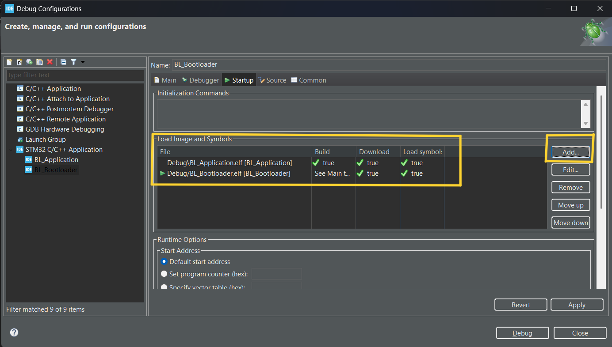

# STM32 Bootlader

This is a simple bootloader project created in stm32 Cube IDE for stm32f401ccu6 black pill. This repo consists of two cube projects bootloader and application. The bootloader project will automatically jump to application when you run it.

Both the bootloader and the application bin files should be flashed to make this work, this can be done at debug configuration > startup code > Add in the bootloader project.

